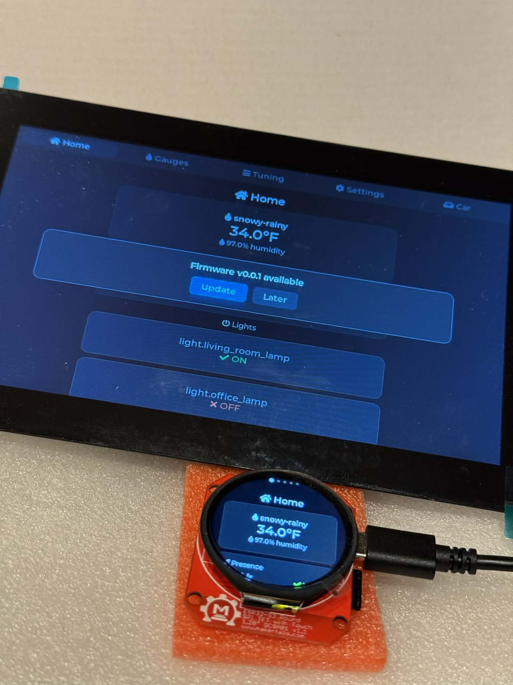
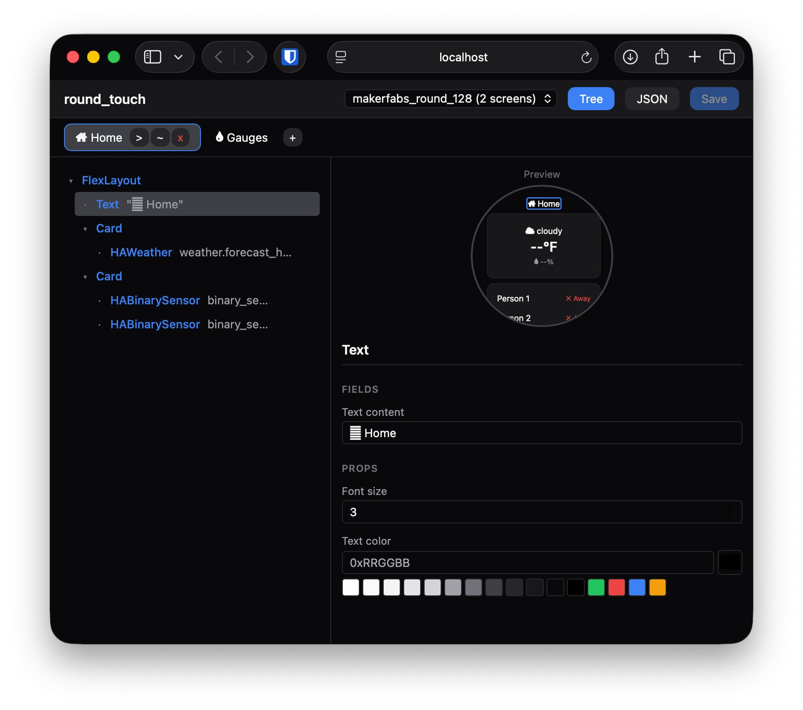

# round_touch

Multi-board ESP32-S3 touch display framework with a declarative UI layer built on LVGL. Dashboards are defined as JSON manifests served over the network — edit them in the web UI, and devices pick up changes on next boot.



## Supported Boards

| Board | Display | Touch | Resolution |
|-------|---------|-------|------------|
| [MakerFabs ESP32-S3 Round 1.28"][makerfabs] | GC9A01 (SPI) | CST816S (I2C) | 240x240 |
| [Waveshare ESP32-S3-Touch-LCD-7][waveshare] | RGB parallel | GT911 (I2C) | 800x480 |
| Desktop simulator | SDL2 | Mouse/keyboard | Configurable |

## Prerequisites

- [uv](https://docs.astral.sh/uv/) (Python package manager, used to run PlatformIO)
- Node.js 20+ (web editor)
- SDL2 (simulator only): `brew install sdl2` on macOS
- CMake 3.16+ (simulator only)

## Setup

```bash
git clone --recursive https://github.com/tandalesc/round_touch.git
cd round_touch
uv sync
```

The `--recursive` flag pulls the LVGL v9.2.2 submodule at `lib/lvgl`. If you already cloned without it:

```bash
git submodule update --init --recursive
```

### Configuration

Copy the config templates and fill in your values:

```bash
# Device firmware config
cp src/config/NetworkConfig.h.example src/config/NetworkConfig.h
cp src/config/HAConfig.h.example src/config/HAConfig.h

# Server config
cp server/server.toml.example server/server.toml
```

Edit `NetworkConfig.h` with your WiFi credentials and server URL. Edit `HAConfig.h` with your Home Assistant entity IDs. Edit `server.toml` with your HA token, LLM endpoints, and secret key.

## First Flash (USB)

The first time you flash a board — or any time you change the partition table — you must use USB:

```bash
# MakerFabs
uv run pio run -e makerfabs_round_128 -t upload && uv run pio device monitor

# Waveshare
uv run pio run -e waveshare_s3_lcd_7 -t upload && uv run pio device monitor
```

After the initial flash, the device supports OTA updates and can be managed entirely from the server.

## Running the Server

The server handles OTA firmware updates, serves UI manifests, resolves dynamic content (templates + LLM), and hosts the web-based dashboard editor. Data is persisted in SQLite.

```bash
cd server
cp server.toml.example server.toml   # then edit with your values
uv pip install -r requirements.txt
cd web && npm install && npm run build && cd ..
uv run python main.py --config server.toml
```

Open `http://localhost:8080` to access the dashboard editor.

On first run, the server auto-imports existing JSON manifests from `ui/` and firmware binaries from the PlatformIO build directory into SQLite.

### Server Configuration

`server.toml` holds all server config (copy from `server.toml.example`):

| Section | Purpose |
|---------|---------|
| Top-level | Firmware dir, secret key, version, port, DB path |
| `[homeassistant]` | HA URL + long-lived access token for data source resolution |
| `[llm]` | Default model key |
| `[llm.models.<key>]` | Per-model `url` (OpenAI-compatible base) and `model_id` (as reported by the endpoint) |

### Development Mode

For frontend development with hot reload:

```bash
# Terminal 1 — Backend
cd server && uv run python main.py --config server.toml

# Terminal 2 — Frontend dev server
cd server/web && npm run dev
```

The Vite dev server at `http://localhost:5173` proxies API calls to the backend.

### Docker

```bash
cd server
docker build -t round-touch-server .
docker run -p 8080:8080 \
  -v $(pwd)/ui:/app/ui \
  -v $(pwd)/storage:/app/storage \
  round-touch-server
```

The `ui/` volume provides manifests for initial import. The `storage/` volume persists firmware binaries.

### OTA Updates

Once the server is running, subsequent firmware updates go over the network:

1. Build the firmware: `uv run pio run -e makerfabs_round_128`
2. The server serves the binary from `.pio/build/{board}/firmware.bin`
3. Devices check for updates on boot and can be triggered from the System Shade (swipe down)

No USB required after the first flash — just rebuild and the device picks it up.

## Dynamic Content

Two component types enable server-rendered content on device screens:

### DynamicText

Resolves `{{prefix:key}}` template placeholders server-side with no LLM involved. Devices poll on a TTL interval using ETag-based conditional requests (304 Not Modified when unchanged).

**Data sources:**

| Prefix | Description | Examples |
|--------|-------------|---------|
| `ha:` | Home Assistant entity state/attributes | `ha:weather.forecast_home`, `ha:sensor.temperature.state` |
| `time:` | Current date/time | `time:now`, `time:date`, `time:time`, `time:weekday` |

HA entities support dot-notation for attributes: `ha:weather.forecast_home.temperature` returns just the temperature attribute value.

### LLMText

Like DynamicText, but after template resolution the result is sent to a local LLM (OpenAI-compatible endpoint) and the response is displayed. Responses are cached with a configurable TTL. Error responses are never cached so the next poll retries.

### Data Source Explorer API

Useful for authoring templates:

```bash
# Test template resolution
curl "http://localhost:8080/api/datasources/resolve?template={{ha:weather.forecast_home.temperature}}F,+{{time:now}}"

# Browse all HA entities
curl http://localhost:8080/api/datasources/ha/entities

# Filter by domain
curl "http://localhost:8080/api/datasources/ha/entities?domain=sensor"

# Search by name
curl "http://localhost:8080/api/datasources/ha/entities?q=temperature"

# Full entity detail with copy-pasteable template refs
curl http://localhost:8080/api/datasources/ha/entity/weather.forecast_home
```

## Dashboard Editor

The web editor at `http://localhost:8080` lets you visually edit device dashboards:



- **Component tree** (left) — add, remove, reorder, and nest components
- **Device preview** (center) — live WYSIWYG preview rendered at native device resolution
- **Property editor** (right) — edit props, colors, icons, and text per component
- **Tab manager** (top) — create, rename, reorder, and delete screen tabs
- **JSON mode** — toggle to raw JSON for direct manifest editing

Per-board manifests live at `server/ui/{board}/screens.json`.

## Simulator

```bash
# Build (240x240 default)
cd simulator/build && cmake .. && make -j8

# Build at Waveshare resolution
cd simulator/build && cmake .. -DSCREEN_WIDTH=800 -DSCREEN_HEIGHT=480 && make -j8

# Run
./round_touch_sim
```

The simulator connects to the same server as real hardware.

## Architecture

```
Device                          Board abstraction (IDisplay, ITouch, IStorage)
  hw/drivers/                   Per-board hardware drivers

Application(&device)
  Workflow                      State machine (system states 0-31, user states 32+)
  Interface                     LVGL rendering + input dispatch
    ComponentManager            Creates/destroys component trees on state change
    ComponentRegistry           Maps type names to factory functions
    UserScreenManager           Parses JSON manifests, builds component trees on demand

Server (server/)
  main.py                       Entrypoint — loads config, starts FastAPI via uvicorn
  app/                          FastAPI application package
    routes/device.py            Device API: version check, firmware download, UI manifests
    routes/editor.py            Editor API: board/manifest CRUD, component schema
    routes/dynamic.py           Dynamic content: DynamicText + LLMText resolution
    routes/datasources.py       Data source explorer: template testing, HA entity browser
    services/datasources.py     Pluggable data sources (ha:, time:) with template engine
    services/llm.py             OpenAI-compatible LLM client
    database.py                 SQLite schema, queries, auto-import migration
    config.py                   TOML config loading
  web/                          React SPA dashboard editor
  ui/{board}/screens.json       Per-board JSON manifests (imported on first run)
```

### Declarative UI

System screens are compiled C++ using the `E()` macro. User dashboards are JSON manifests served from the server:

```cpp
E(FillScreen, {},
  E(TouchNavigation, onSwipeUp(GO_BACK)),
  E(Text, {.size = 4}, LV_SYMBOL_SETTINGS " System")
)
```

```json
{
  "type": "FlexLayout",
  "props": {"direction": "column", "align": "center", "gap": 12},
  "children": [
    {"type": "Text", "props": {"size": 4}, "text": "\uF015 Home"},
    {"type": "Card", "children": [
      {"type": "HAWeather", "entity": "weather.home"}
    ]}
  ]
}
```

## Board-Specific Notes

### MakerFabs

- Uses SPI3_HOST for the GC9A01 display (SPI2 causes DMA hangs)
- Requires double-buffered LVGL flush with RGB565 byte swap
- USB serial: `ARDUINO_USB_CDC_ON_BOOT=1`

### Waveshare

- CH422G I/O expander controls display backlight, touch reset, and SD CS
- IO5 (USB_SEL) must stay LOW or USB serial disconnects
- Wire (I2C) must be re-initialized after RGB panel init
- USB serial: `ARDUINO_USB_CDC_ON_BOOT=1` + `ARDUINO_USB_MODE=1`

[makerfabs]: https://github.com/Makerfabs/ESP32-S3-Round-SPI-TFT-with-Touch-1.28
[waveshare]: https://www.waveshare.com/wiki/ESP32-S3-Touch-LCD-7
